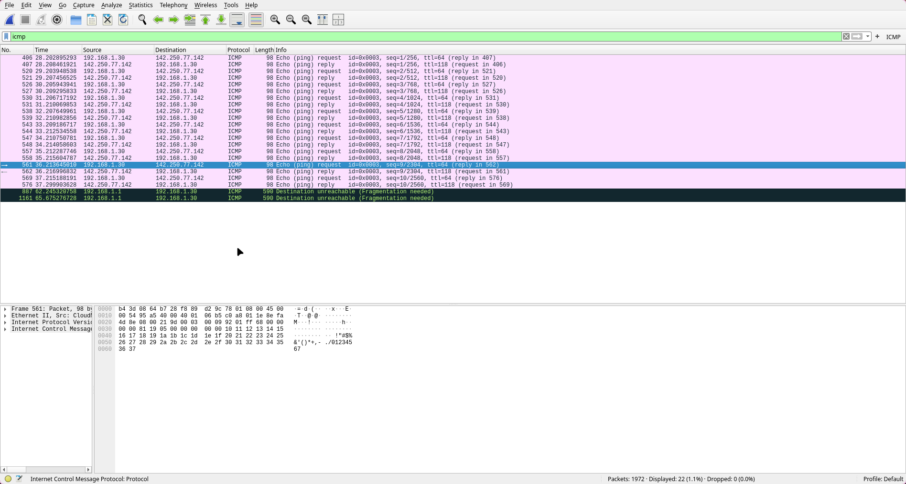

# Day 5: Introduction to Wireshark 

## Installation 

Wireshark was installed from the official repository using the command: 

```yay -S wireshark-qt```

## Packet Capture

After installation, wireshark was opened with sudo privileges to start packet capture on the interface wlan0 

```sudo wireshark``` 


The packet capture was stopped after a minute to identify various protocols that were used on the wire. Common filters like HTTP, DNS and TCP were applied to examine packets of specific types. After wireshark was started, a ping command was used to send 10 packets to the domain google.com using the following command: 

```ping -c 10 google.com```

Since ping uses the ICMP protocol, the icmp filter was applied in wireshark to display the packets. The filter displays 20 packets which represents 10 exchanges to the server with IP 142.250.77.142. 



Analyzing the capture further also revealed the presence of STUN packets. The STUN (Session Traversal Utilities for NAT) protocol is used so that devices behind a NAT can discover ther public facing IP address. This can be discovered using the command: 

```curl ifconfig.me```

This STUN packet is most likely from my tailscale daemon which establishes a peer to peer connection to devices outside my NAT by leveraging the STUN protocol. 


The capture also revealed the presence of many TLS packets. TLS (Transport Layer Security) is a cryptographic protocol which encrypts the data that is transmitted across a network. The capture reveals that there is a TLS handshake happening to the IP 8.8.8.8 and 1.1.1.1 both of which our DNS servers I have personally configured. This shows that there is DNS over TLS happening on my system. After the handshake, the capture also shows the transmission of encrypted application data. 


## References 

https://www.youtube.com/watch?v=qTaOZrDnMzQ - Wireshark Tutorial 


